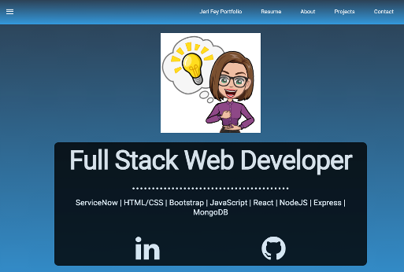

# React Portfolio

Personal project portfolio site using React and hosted on Heroku.

## Description

This projects uses React, React Router, React-PDF and React-mdl.

## Table of Contents

- [NPM Packages used](#NPM-Packages)
- [Installation](#installation)
- [Usage](#usage)
- [Deployment](#Deployment)
- [Functionality](#Functionality)
- [License](#license)
- [Contributing](#Contributing)
- [Questions](#Questions)

## NPM-Packages

[React-PDF](https://www.npmjs.com/package/react-pdf)
[react-router-dom](https://www.npmjs.com/package/react-router-dom)
[@material-mdl](https://tleunen.github.io/react-mdl/components/)

## Installation

If you clone the repository and run

> npm i

all required npm packages will be installed. Once installation is complete then start the application with

> npm start

## Usage

This application includes a Title page with clean styling. A portfolio page with application sorting function based on topic (\*still in the works). It also has a Contact Me page, About Me and Resume page that renders a PDF.

## Deployment

Heroku: https://enigmatic-bastion-47766.herokuapp.com/

## License

MIT - A short, permissive software license. Basically, you can do whatever you want as long as you include the original copyright and license notice in any copy of the software/source. There are many variations of this license in use.

## Badges

## Contributing

## Questions

If you have any questions about the project, please reach out at (https://www.linkedin.com/in/jerifey/)
